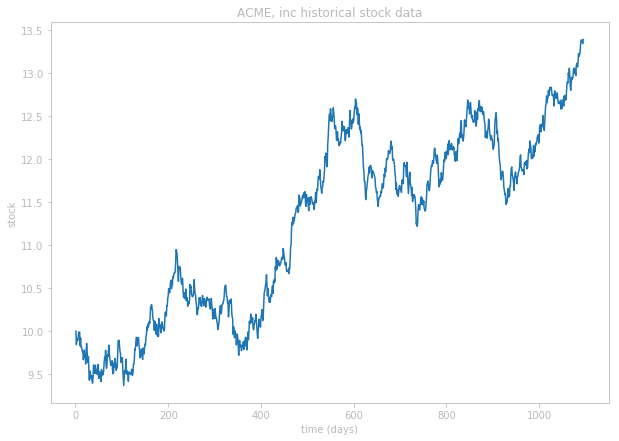
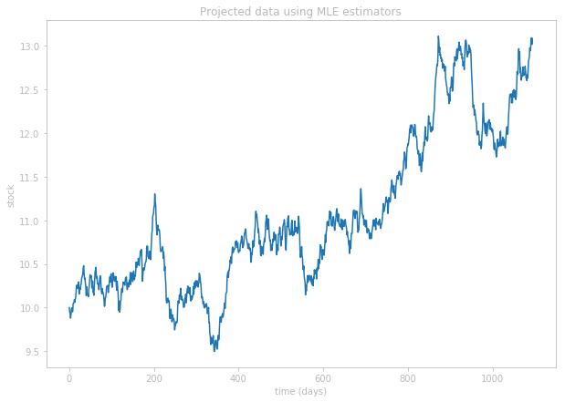
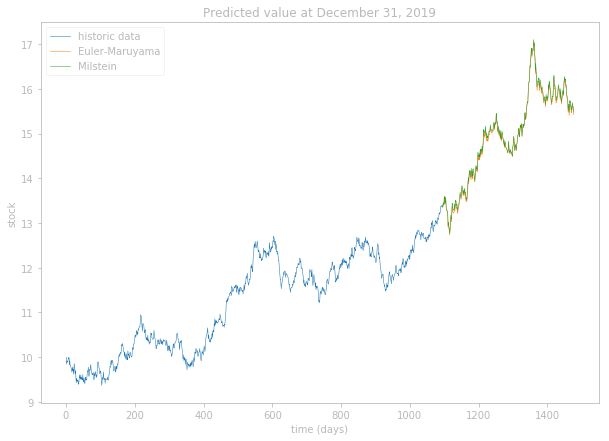
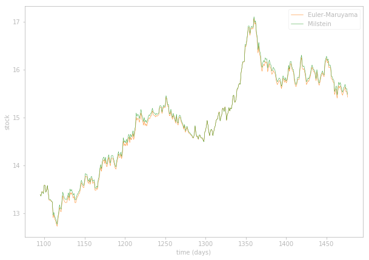
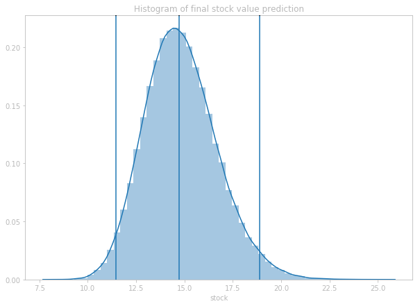

# Euler Maruyama

The objective of this project is to predict the future value of the stock using the model $\frac{dS}{S} = \mu dt + \sigma dW$ where S is the value of the stock, $\mu$ is a drift constant, $\sigma$ is the volatility constant, and $W$ is a one dimensional Brownian motion. The historical value of S can be seen from the following graph:

<div align="center">

  
</div>

Using this data, the key to predicting future stock value is by estimating the unknown parameters $\mu$ and $\sigma$. There are multiple ways in which these parameters can be estimated, and there are also multiple methods to predict the future stock value.

## Methods

A one dimensional Brownian process with $W_0 = 0$ is often referred to as the _Wiener process_. Wiener process has some key characteristics:
- $W_0 = 0$
- $W_{t+u} - W_t$ is independent of past walks $W_{t}$
- $W_{t+u} - W_t$ is normally distributed with mean 0 and variance $u$ ($`W_{t+u} - W_t \sim \mathcal{N}(0, u)`$)
- $W_t$ is continuous in $t$

This reveals an important property about the term $dW$ &mdash; $dW_t$ is defined as the differential of $dW$ at time $t$, meaning $dW_t = W_{t+dt} - W_t$. Using the characteristics stated above, this means that $dW_t = W_{t+dt} - W_t \sim \mathcal{N}(0, dt)$.

The terms $dS$, $S$, and $dW$ can all be expressed in terms of $t$, deriving the equation $\frac{dS_t}{S_t} = \mu dt + \sigma dW_t$. Using the data we have for the stock value $S$, we can approximate this model using finite differences, which then becomes $\frac{\Delta S_t}{S_t} = \mu \Delta t + \sigma \Delta W_t$. From our data, we know that $\Delta t = 1$, which implies that $\Delta W_t = W_{t+\Delta t} - W_t = W_{t+1} - W{t} \sim  \mathcal{N}(0, 1)$. This further allows us to make the derivation $\sigma \Delta W_t \sim \mathcal{N}(0, \sigma^2) \implies \mu \Delta t + \sigma \Delta W_t = \mu + \sigma \Delta W_t \sim \mathcal{N}(\mu, \sigma^2)$. We therefore have $\frac{\Delta S_t}{S_t} = \mu \Delta t + \sigma \Delta W_t \sim \mathcal{N}(\mu, \sigma^2)$. Hence, $\frac{\Delta S_t}{S_t}$ is normally distributed with mean $\mu$ and variance $\sigma^2$. 

There are different ways to find the value of $\frac{\Delta S_t}{S_t}$. Two of the obvious choices are forward difference: $\frac{\Delta S_t}{S_t} = \frac{S_{t} - S_{t-1}}{S_t}$ and backward difference: $\frac{\Delta S_t}{S_t} = \frac{S_{t+1} - S_t}{S_t}$. I felt that a more accurate measurement of the value can be found by using midpoint difference: $\frac{\Delta S_{t+1/2}}{S_{t+1/2}} = \frac{S_{t+1} - S_t}{S_{t+1/2}} = \frac{2(S_{t+1} - S_t)}{S_{t+1} + S_t}$. Letting $S$ be an array containing the values of $S_t$ at each $t$, this can be computed with one line of Python code:
```
LHS = 2(S[1:] - S[:-1]) / (S[1:] + S[:-1])
```

## Estimators for $\mu$ and $\sigma$

From here on, we will be more lax with the notation and simply use $\frac{dS}{S}$ for $\frac{\Delta S_t}{S_t}$. Let $Z = \frac{dS}{S}$. Since $Z \sim \mathcal{N}(\mu, \sigma^2)$, $\mu$ and $\sigma^2$ can be estimated most easily by solving for the sample mean and variance estimators:
```math
\begin{split}
  \hat\mu = \frac{1}{n}{\Large\sum}_{i=1}^{n} z_i\\
  \hat\sigma^2 = \frac{1}{n-1}{\Large\sum}_{i=1}^{n} (z_i - \hat\mu)^2
\end{split}
```

Using this method, we get the following estimates for $\mu$ and $\sigma$:

```
N = len(T) - 1
mu_hat = np.mean(LHS)
var = (1/(N-1))*np.sum([(xi-mu_hat)**2 for xi in LHS])
sig_hat = np.sqrt(var)
mu_hat, sig_hat
(0.00026697213399613643, 0.006401775859714401)
```

Another way of finding an estimator is by solving for the Maximum Likelihood Estimator (MLE). MLE can be found by finding the maximizer of the likelihood function:
```math
\begin{align}
  \mathcal{L}(\mu, \sigma) & = {\Large\prod}_{i=1}^{n} f(z_i;\mu, \sigma) \\
  & = {\Large\prod}_{i=1}^{n} \frac{1}{\sqrt{2\pi \sigma^2}} \exp(\frac{-1}{2\sigma^2}(z_i - \mu)^2) \\
  & = (\frac{1}{\sqrt{2\pi \sigma^2}})^n \exp(\frac{-1}{2\sigma^2}{\Large\sum}_{i=1}^{n}(z_i - \mu)^2)
\end{align}
```

Finding the maximizer of the likelihood function is equivalent to finding the minimizer of the negative log-likelihood function $NLL(\theta) = -\log(\mathcal{L}(\theta))$:
```math
\begin{align}
  NLL(\mu, \sigma) & = -\log((\frac{1}{\sqrt{2\pi \sigma^2}})^n \exp(\frac{-1}{2\sigma^2}{\Large\sum}_{i=1}^{n}(z_i - \mu)^2)) \\
  & = n \log(\sqrt{2\pi \sigma^2}) + \frac{1}{2\sigma^2}{\Large\sum}_{i=1}^{n}(z_i - \mu)^2 \\
  & = n \log(\sqrt{2\pi \sigma^2}) + \frac{1}{2\sigma^2}\lVert\textbf{Z} - \mu\mathbb{1}\lVert_2^2
\end{align}
```

The MLE for $\mu$ and $\sigma$ is 

```
from scipy.optimize import minimize
NLL = lambda Z: N*np.log(np.sqrt(2*np.pi*Z[1]**2)) +(1/(2*Z[1]**2)) *
                np.linalg.norm(LHS - np.ones(N)*Z[0])**2
mu_MLE, sig_MLE = minimize(NLL, (5,5), method='Nelder-Mead')['x']
mu_MLE, sig_MLE
(0.00026783, 0.00639917)
```

We can see that the sample estimator method and the MLE method yields a very similar result. It seems inconsequential to use one from the other, but for the sake of consistency, I will be using the MLE for all future experiments.

## Simulation

We use the estimators found in the previous section, set $S_0 = 10$ (same as given in the data) and use the same number of time steps to produce the following simulation:

<div align="center">
  
  
</div>
    
Each experiment is subject to variation, so this does not guarantee the accuracy of the estimators found. However, from the given data, it is the most suitable option. Using the estimators, we are now ready to make predictions. We first simulate a possible future values using the two numberical methods: Euler-Maruyama method, and the Milstein method. 
The Euler-Maruyama method is simply using the definition of the equation given with finite difference and predicting for some time T. In our case, predicting the stock value for December 31, 2019 is equivalent of solving for $T=1476$. The Milstein method is similar but also takes into account Itô's lemma. Specifically, the two numerical methods are defined as below:

Euler-Maruyama: $`S_{t+1} = S_t + \mu S_t \Delta t + \sigma S_t \Delta W_t`$

Milstein: $`S_{t+1} = S_t + \mu S_t \Delta t + \sigma S_t \Delta W_t + \frac{1}{2}\sigma ((\Delta W_t)^2 - \Delta t)`$

Using these two methods, we can simulate future values.

<div align="center">
  
   
</div>
    
We can see that although slightly different at times, the two methods behave in a very similar way. 

## Final estimation

We can make the final estimation using the analytic solution of the model or by Monte-Carlo simulations. To find the analytic solution, we first observe that $\frac{dS_t}{S_t} = d\log{S_t}$ then applying the Itô's rule, we get
```math
\begin{split}
    $\frac{dS_t}{S_t} = \mu dt + \sigma dW_t$ \\
    \implies d\log{S_t} = \mu dt + \sigma dW_t - \frac{1}{2}\sigma^2dt \\
    \implies S_t = S_0 \exp{((\mu - \frac{1}{2}\sigma^2)t + \sigma W_t)} \\
\end{split}
```

Using the analytic solution and setting $t$ to be the difference in time between the final prediction and the final given data, and $S_0$ to be the final given data, we can solve for the mean value of the final prediction by setting $W_t$ to be zero (since $W_t$ is centered at 0). We can also compute for the 95\% confidence interval by letting $W_t$ to be $\pm 2\sqrt{t}$, since $\sqrt{t}$ is the standard deviation of $W_t$ and the z-score of $\pm 2$ gives the 95\% confidence band.
```
mean = 14.715470815100911
confidence_interval = [11.462554156937284, 18.89152089013519]
```

We can also estimate the distribution over the final prediction value by performing Monte-Carlo simulation using the prediction methods discussed above. Using the Milstein method, we predict for the final value with 100,000 trials and plot the resulting data as a histogram. The vertical lines represent the lower 95\% confidence bound, the mean, and the upper 95\% confidence bound found using the analytic solution, respectively. 

<div align="center">
  
</div>

The resulting mean of the Monte-Carlo simulation is 14.8285, which is slightly different from the value found using the analytic solution, but that is to be expected since one is a result of discrete experimentation and the other continuous.
